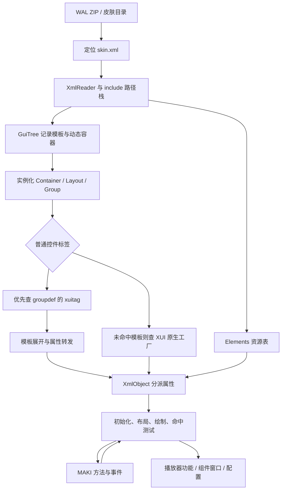

# Winamp WAL 全部控件解析：源码分析与重建版差距

> 本文的“当前实现”描述为本轮修复前快照。最新状态请看 [WAL 扩展与启动修复](WAL_EXPANSION_FIXES_2026_09_24.md)。

分析日期：2026-09-24。依据本地 `D:\Projects\Backup\TTPlayer\winamp` 源码、附带 XML 资源，以及当前 `waskin/src/modern.cpp`、`modern_objects.h`、`makivm/src/vm.cpp`。本次为静态分析，不修改运行代码。

## 1. 结论与“全部控件”的范围

**WAL 是包含 XML、图片、字体、MAKI 字节码等资源的皮肤包。原版以 XML 创建具有原生行为的对象，再让 MAKI 操作这些对象。独立 VM 只是其中一层。**

本次清单覆盖：

- 本地 Wasabi / gen_ff 源码中的 **66 项 C++ XUI 控件标签声明**；包含 `Group/CfgGroup` 的声明、`Component/WindowHolder` 别名，以及旧版、调试或未注册的代码。
- 本地随附 XML 中 **25 种 `groupdef xuitag` 自定义标签，44 处定义**；其中 `Wasabi:EditBox` 与 C++ 声明重叠。
- 不属于可见控件，但决定控件创建的结构、资源、脚本、吸附与本地化标签。
- 控件共同继承的属性、原生行为、MAKI 方法／事件，以及重建版支持范围。

这不是“Winamp Release 固定有 66 个可用控件”的结论。实际可用集合由编译宏、注册代码、加载的系统 XML、皮肤 XML 和外部插件决定。第三方皮肤还可以定义任意新 `xuitag`，不存在能够列尽所有未来 WAL 标签的固定名单。

逐项源码、完整属性声明和 MAKI 导出方法见配套文档 [WAL_CONTROL_REFERENCE.md](WAL_CONTROL_REFERENCE.md)。其中区分声明清单与实际注册，不把占位实现算作完整功能。

## 2. 从 WAL 文件到可交互窗口



### 2.1 归档入口与根 XML

`Winamp/Skins.cpp` 用 minizip 读取包，查找根 `skin.xml` 或皮肤同名子目录下的 `skin.xml`。`gen_ff/main.cpp::onSkinSwitch` 通过 `IPC_GETSKINW` 获取皮肤目录，再探测 XML、调用皮肤切换接口。因此现代皮肤的识别依据包含内容，不能仅靠 `.wal` 后缀。

`SkinParser::initialize` 同时注册 `WinampAbstractionLayer` 与 `WasabiXML` 根的回调。`loadContainers` 初始化解析状态、资源事务和脚本上下文，然后加载 XML。除皮肤自身文件外，`Widgets::loadResources` 还会加载 Winamp 随附的 Wasabi、复选框、下拉框、状态栏等 XML；这类系统资源可能不在 WAL 内。

### 2.2 include 是带上下文的展开

`api/xml/XMLAutoInclude.cpp` 的实际流程是：

1. 读取 `file`，通过变量管理器替换公共路径变量。
2. 相对当前 include 路径组合文件名；支持绝对路径和通配文件集合。
3. 中断外层解析，将路径切换到被包含文件的目录。
4. 解析完成后恢复旧路径，继续外层 XML。

资源记录和 `GuiTreeItem` 都保存来源路径。XML 里的相对图片、脚本文件不能一概按包根目录解释。独立实现可把访问范围限制在包内，但仍需保留“相对当前来源文件”的语义，并对不支持的外部依赖给出明确结果。

### 2.3 先记录模板，再实例化

`groupdef` 与动态 `container` 可以先记录到 `GuiTree`，不是读到标签就创建窗口。`newDynamicGroup`、`fillGroup`、`parseGroup` 在需要时重放记录。

- 相同 ID 的 Group 定义可保留多代；`getGroupDef` 取最新定义，`getGroupDefAncestor` 找前一代。
- `inherit_group` 可指定另一模板；`inherit_content` 支持 `xui`、`scripts`、`params` 等组合；`inherit_params` 参与属性继承。
- 内容重放与属性应用是分开的；`fillGroup` 按源码规定的逆序遍历祖先参数列表，实例上的 XML 属性随后再应用。不能简单等同于覆盖一个字典。
- 自定义 `xuitag` 的查找发生在原生工厂查找之前，皮肤可以用组合模板提供控件外观。

### 2.4 原生控件创建与属性分派

`createExternalGuiObject` 先查 XUI 工厂缓存，再枚举 `svc_xuiObject::testTag`，最后调用 `instantiate(tag, params)`。原始属性也传给工厂，因此属性可能决定**创建哪种 C++ 类型**，`Slider` 就是实例。

`initGuiObject` 将对象加入父 Group；`initXmlObject` 按参数枚举顺序调用 `setXmlParam`。多数控件使用：

```text
XML 属性名
  -> XmlObjectI 的参数表（名称匹配不区分大小写）
  -> 属性所属的 xuihandle + attrid
  -> 派生控件 setXuiParam
  -> 不属于本类时交给父类
  -> 实际 setter、重排、重绘、配置或播放器回调
```

所以“保存了 XML 属性字符串”不等于“已经实现属性”。运行期间 MAKI 的 `setXmlParam` 也应走相同 setter，而不是只改变缓存值。

### 2.5 未知属性不一定是错误

普通 `XmlObjectI` 默认忽略未注册属性；但 Group 的未知属性还可能是自定义 XUI 参数：

- 初始化前先缓存；`Group::startScripts` 调用脚本 `onLoad` 后，再发送 `onSetXuiParam`。
- 初始化后变化时直接通知脚本。
- `embed_xui` 指向模板内部对象；`EmbeddedXuiObject` 转发未被外层处理的参数，并处理接口转换与配置绑定。

例如 `Wasabi:Button` 是 Group 模板，内部包含 `Button id="wasabi.button"`，并用 `embed_xui` 转发按钮参数。只给标签加个别名无法恢复这种行为。

## 3. 所有可视控件共同需要的基础能力

### 3.1 几何和尺寸

基础声明在 `GuiObjectWnd::params`，实际属性处理在 `GuiObjectI`，子控件坐标计算在 `Group::updatePos`。

| 属性 | 原版含义 |
| --- | --- |
| `x/y/w/h` | 逻辑位置与尺寸；缺省宽高可以使用控件自动尺寸，不等于 0 |
| `relatx/relaty/relatw/relath=0` | 使用绝对逻辑值 |
| `relat*=1` | 父区域对应尺寸加上给定偏移；例如 `w=-20 relatw=1` 为父宽减 20 |
| `relat*=2` | 按父区域对应尺寸的百分比计算 |
| `fitparent` | 建立填充父区域的几何关系；负值还能形成内边距 |
| `anchor, x1/y1/x2/y2` | 按设计边界和锚点保持边距或拉伸 |
| `sysmetricsx/y/w/h` | 结合系统字体尺度调整对应数值 |
| Group 的 `default_* / minimum_* / maximum_* / design_*` | 自动尺寸、设计尺寸与最小最大约束 |
| `autowidthsource/autoheightsource` | 由指定内部对象的尺寸推导 Group 尺寸 |

忽略渲染缩放和字体尺度时，`relatw=1` 可直观理解为 `实际宽 = 父宽 + w`；`relatw=2` 为 `实际宽 = 父宽 × w / 100`。这两种模式不能合并成布尔值。

### 3.2 可见性、区域与输入

- `alpha/activealpha/inactivealpha`、`visible/enabled`：绘制和交互状态，不只是贴图透明通道。
- `ghost`：鼠标穿透；`move`：是否作为窗口拖动区域。
- `rectrgn`、`sysregion/regionop`：矩形／异形区域，以及子区域的合并、相交、相减。
- `noleftclick/norightclick/nodblclick/nomousemove/nocontextmenu`：过滤不同输入路径。
- `wantfocus/focusonclick/taborder`：焦点、键盘导航与点击获得焦点。
- `tooltip/cursor`：控件提示和皮肤光标。
- `cfgattrib`：与配置属性绑定；`notify*`：通知链；`droptarget`：拖放服务连接。

绘制、窗口区域和鼠标命中不是同一个集合。即使像素完全一样，忽略 `ghost` 或 `enabled` 也会把鼠标事件发给错误控件。

### 3.3 通用 MAKI 接口

GuiObject 提供显示、透明度、位置、大小、坐标换算、焦点、层级调整、对象查找、配置、动作和输入事件。目标动画支持 X/Y/W/H/Alpha、速度、取消、反向和结束通知，并非只有 `setTargetX`。

对象还需要正确的类 GUID、父类接口与生命周期。脚本的 `Button`、`Slider`、`Layer` 类型转换，并不等同于判断“这个指针属于对象数组”。`Timer`、`Map`、`Region`、`PopupMenu`、配置对象等是脚本对象，不能混入 XML 可见控件数量。

## 4. 控件分类及解析行为

下表列出各族关键行为；每项完整属性声明、类名和源码定位在配套清单。表中的“属性”只列本节重点，均需叠加父类属性。

### 4.1 窗口、组与内容容器

| 标签 | 关键属性／处理 | 必须恢复的行为 |
| --- | --- | --- |
| `Container`（结构标签） | `id/name/dynamic/default_x/default_y/default_visible/canclose/nomenu/primarycomponent` | 管理多个 Layout、动态创建、默认可见性与布局切换；本身不是一张位图 |
| `Layout`（结构标签） | 继承 Group；`desktopalpha/osframe/ontop/nodock/lockto/linkwidth/linkheight/snapadjust*/resizable/scalable` | 顶层窗口、缩放、吸附、尺寸限制和状态保存 |
| `Group` | 根据 `groupdef` 建立内容；`instanceid/background/inherit_*/embed_xui` | 模板实例、ID 作用域、背景、参数转发、脚本生命周期 |
| `CfgGroup` | Group 加配置访问接口 | 配置变化通知和读写，不是另一种纯绘图节点 |
| `GuiObject` | 只有基础 GuiObject 行为 | 通用 GUI 节点；可以作为内容和脚本接口的承载对象 |
| `GroupList` | 主要通过 MAKI `instantiate(id,n)` 操作 | 创建多个 Group、纵向排布、滚动及销毁 |
| `GroupXFade` | `group/groupid/speed` | 双内容组交替、Alpha 交叉渐变及旧内容释放 |
| `CustomObject` | `groupid` | 用指定 Group 或根窗口替换内部内容 |

### 4.2 图片、图形、动画与输入代理

| 标签 | 关键属性／处理 | 必须恢复的行为 |
| --- | --- | --- |
| `Layer` | `image/inactiveimage/region/tile/quality/resize/scale/cursor/dblclickaction` | 位图裁剪、拉伸或平铺、区域、拖动/缩放边缘；还提供脚本 FX 接口 |
| `AnimatedLayer` | Layer 加 `framewidth/frameheight/elementframes/start/end/speed/autoplay/autoreplay/realtime` | 横排或竖排帧、多个资源帧、播放状态与 `onFrame`；不是仅把 PNG 当静态图 |
| `Grid` | `topleft/top/topright/left/middle/right/bottomleft/bottom/bottomright` | 九区边框绘制，边角和中部按自身规则扩展 |
| `Rect` | `color/edges/filled/thickness/gammagroup` | 选定边、边宽、实心／空心矩形 |
| `Gradient` | `gradient_x1/y1/x2/y2/points/gammagroup` | 渐变方向、颜色节点和主题处理 |
| `MouseRedir` | `target`，脚本 Region | 将输入转给另一对象；目标区域和显示对象可不同 |
| `AlbumArt` | `source/notfoundimage/align/valign/stretched/noautorefresh` | gen_ff 的封面加载控件；异步加载、缺图回退、播放切换刷新、完成事件 |

`AnimatedLayer` 的帧速度与 GuiObject 目标移动动画是两套计时机制。不要把两者合并，也不要把 Layer 的 FX 当成外部 AVS 引擎。

### 4.3 按钮和状态按钮

| 标签 | 关键属性／处理 | 必须恢复的行为 |
| --- | --- | --- |
| `Button` | `image/downimage/hoverimage/activeimage/action/param/action_target/text/borders/style/retcode` | 正常、按下、悬停、激活状态；文字按钮、原生动作、目标动作和左右点击事件 |
| `ToggleButton` | Button 加 `autotoggle/cfgval` | 开关状态、配置同步、`onToggle` |
| `NStatesButton` | ToggleButton 加 `nstates/autoelements/cfgvals` | 多状态循环，状态资源与配置值映射 |
| `Menu` | `normal/down/hover/menu/menugroup/next/prev` | 以 Group 显示菜单按钮状态，维护相邻菜单链、弹出/关闭、键盘与鼠标菜单导航 |

原生按钮的 `onLeftPush` 先发脚本 `onLeftClick`，再检查 MAKI `complete`，随后才继续对应动作路径。`action_target` 可以把动作交给另一个对象，普通动作也可交给 `svc_action`。所以只建立“动作名→播放器命令”表，覆盖不了窗口切换、目标动作、菜单和配置联动。

### 4.4 滑块与进度显示

| 标签 | 关键属性／处理 | 原版行为 |
| --- | --- | --- |
| `Slider` | `thumb/downthumb/hoverthumb/barleft/barmiddle/barright/low/high/hotpos/hotrange/orientation/stretchthumb` | 通用范围、吸附点、条背景、滑块拖动、配置与事件 |
| `VolBar` | Slider 子类 | 原生音量读写及变化回调 |
| `PanBar` | Slider 子类 | 显示范围与播放核心左右声道平衡转换 |
| `SeekBar` | `interval`；内部范围 0～65535 | 定时同步播放位置，最终拖动位置才提交 seek；脚本接口还使用除数 256 |
| `EqBand` | `band/param`；范围 -127～127 | 指定 EQ 频段、核心回调；源码还有连续拖过相邻频段的处理 |
| `EQPreAmp` | Slider 子类 | 独立的前置增益，不应当作普通频段 1 |
| `images` | `images/imagesspacing/source` | 旧式图片序列音量、平衡、进度显示，按状态选取图集帧 |
| `ProgressGrid` | Grid 加 `orientation/interval` | 根据播放进度改变绘制区域，默认用于显示，不等同于可拖动 Slider |

尤其需要注意 `SliderXuiSvc::instantiate` 在创建对象时读取 `action`：

```text
seek               -> SSeeker
volume             -> SVolBar
pan                -> SPanBar
eq_band + preamp   -> SEQPreamp
eq_band            -> SEQBand
eq_preamp          -> SEQPreamp
其它/未指定         -> PSliderWnd
```

方向解析接受 `v` 和 `vertical`。脚本事件包括 `onSetPosition`、`onPostedPosition`、`onSetFinalPosition`，还支持 `lock/unlock`。原生数据更新和用户拖动必须分开，避免状态回传又触发播放命令。

### 4.5 文本、编辑与状态显示

| 标签 | 关键属性／处理 | 原版行为 |
| --- | --- | --- |
| `Text` | TextBase 字体/颜色/对齐加 `text/default/display/ticker/wrap/showlen/shadow*/offset*/timer*` | 静态文字、歌曲信息、时间、滚动、换行、测量与备用样式 |
| `Edit` | `text/multiline/password/autoselect/autohscroll/vscroll/autoenter/action` | 编辑、选择、输入法/焦点、回车与取消、即时及空闲编辑更新事件 |
| `TitleBar` | `title/streaks/border/maximize/dblclickaction` | 标题文字、装饰及标题栏双击行为 |
| `SongTicker` | Text 派生，加滚动模式 | gen_ff 歌曲标题滚动，播放核心数据更新 |
| `Status` | `playbitmap/pausebitmap/stopbitmap` | 随核心播放状态切换图像 |
| `LayoutStatus` | `includeonly/exclude` | 布局状态文本/进度接收器；不是播放状态图标 |

`Text::display` 支持歌名、标题、作者、专辑、长度、已播/剩余时间、码率、采样率等，并可连接文本源服务。`TextBase` 还有 `font/fontsize/color/align`、粗体/斜体、抗锯齿、左右留白、备用字体和颜色。`font` 可能引用 `bitmapfont` 或 `truetypefont` 资源，不能统一替换成固定 Tahoma。

### 4.6 频谱和均衡器曲线

| 标签 | 关键属性／处理 | 原版行为 |
| --- | --- | --- |
| `Vis` | `mode/channel/fliph/flipv/fps/falloff/peakfalloff/bandwidth/peaks/oscstyle/colorband*/colorosc*` | SAWnd 绘制频谱或示波器，含衰减、峰值、颜色、实时帧事件和模式保存 |
| `EQVis` | `colortop/colormiddle/colorbottom/colorpreamp/gamma` | 根据 EQ 数值绘制曲线与前置增益显示 |

`Vis` 不等于 `<Component param="guid:avs">`：前者是内部频谱控件，后者请求宿主的 AVS 组件。当前插件两者都可借用千千视觉回调，但这只能表示有视觉内容，不能表示外观、参数和脚本接口与 Winamp 完全一致。

### 4.7 组合表单控件

| 标签 | 关键属性／处理 | 原版行为 |
| --- | --- | --- |
| `Wasabi:CheckBox` | `text/radioid/radioval/action/param/action_target` | 可换肤的复选或单选项，组合内容、配置与切换事件 |
| `Wasabi:RadioGroup` | 接收子项 `REGISTER/TOGGLE` 动作 | 维护互斥关系，无需每个皮肤自行写取消其它项的脚本 |
| `Wasabi:DropDownList` | `items/feed/select/listheight/maxitems/antialias` | 列表数据、弹出窗口、选择同步、脚本操作 |
| `Wasabi:ComboBox` | 继承下拉框，并加入编辑内容 | 自定义文本与选择项共同工作 |
| `Wasabi:HistoryEditBox` | ComboBox 加 `navbuttons` | 输入历史与导航按钮 |
| `Wasabi:EditBox` | 首先可由系统 XML 的同名 `xuitag` 提供 | 带皮肤边框的 Edit；C++ 中也存在旧包装声明，不能只看它判断实际路径 |
| `Wasabi:PathPicker` | 系统 Group + 路径配置 | 文本、浏览按钮、目录选择器和 `onPathChanged` |
| `Wasabi:Frame` | `left/top/right/bottom/orientation/from/width/height/resizable/min*/max*/vbitmap/vgrabber` | 用两个 Group 建立可拖动分隔框；部分纵横属性是同一内部 ID 的别名 |
| `Wasabi:TabSheet` | `children/windowtype/type/content_margin_*` | 创建、切换、销毁内容页面，支持按窗口类型装载内容 |
| `Wasabi:TitleBox` | `title/content/suffix/centered` | 标题边框和内部内容 Group |

这些名字中的 `Wasabi:` 是原版 XUI 的标签命名方式，并不表示独立实现必须启动 Wasabi 服务。可用自己的 C++ 控件与模板解析器实现同样的契约。也不能直接删除前缀，把 `Wasabi:Button` 当 `Button`：前者可能有系统边框、默认高度、内部对象与参数转发。

### 4.8 列表、树、目录与服务数据

| 标签 | 关键属性／处理 | 原版行为 |
| --- | --- | --- |
| `List` | `items/feed/select/multiselect/autodeselect/hoverselect/sort/numcolumns/columnwidths/columnlabels` | 通用多列列表、排序、多选、键盘、滚动、大量项目级 MAKI 方法和事件 |
| `Tree` | `items/feed/sorted/childtabs/expandroot` | 树节点、展开/折叠、标签编辑、选择、拖放；TreeItem 是另外的脚本对象 |
| `PlaylistEditor` | gen_ff 的列表派生类 | 读取播放器队列、播放项与时长、原生播放和列表操作 |
| `PlaylistDirectory` | gen_ff 目录对象 | 播放列表集合，重命名、播放、追加和刷新 |
| `ObjDirView` | `dir/target/displaytarget/defaultdisplay/forcevirtual` | 连接对象目录服务并显示其项目，不能等同于文件系统目录树 |
| `ColorThemes:List` | `nohscroll`，列表派生 | 显示与切换颜色主题 |
| `ColorThemes:Mgr` | `NakedObject` 派生的无可视主题管理器 | 通过动作维护和切换主题；不绘制 `ColorThemes:List` 那样的项目列表 |
| `DownloadsList` | `nohscroll`，静态服务声明 | 下载状态列表；该文件在 gen_ff 项目中，不能因 Widgets 中有注释行就认定完全不可用 |
| `BookmarkList` | 本地只有空属性和空 `set()` 等骨架 | 存在声明，不应计为完成的书签功能 |
| `QueryDrag` | `image/source` | 旧数据库查询拖动对象，受关闭的查询控件宏控制 |
| `QueryResults` | `title`，查询列表父类 | 显示数据库查询结果，依赖旧查询服务 |
| `QueryLine` | 旧式 `addParam` 注册 `querylist/query/auto` | 连接查询列表并更新过滤表达式；不能用只扫描 XMLParamPair 的方式漏掉它 |

`List`、`PlaylistEditor`、`Component param="guid:pl"` 是三条不同路径。当前 HeadAMP 支持的是最后一种所需的宿主列表桥接，不代表前两种已经实现。

### 4.9 嵌入窗口、浏览器与组件

| 标签 | 关键属性／处理 | 原版行为 |
| --- | --- | --- |
| `WindowHolder` / `Component` | `param/component/hold/autoopen/autoclose/autofocus/autoavailable` | 同一个 XuiWindowHolder 的两种标签，按 GUID 或 Group 接收内容，管理真实窗口生命周期 |
| `ComponentBucket` | `wndtype/vertical/spacing/leftmargin/rightmargin` | 组件选择/排列/滚动，连接类型与窗口管理系统 |
| `OSWndHost` | `hwnd/offsets` | 嵌入现有系统 HWND，不是图片或任意 Group |
| `Browser` | `url/targetname/scrollbars/mainmb` | 原生浏览器服务、导航事件、网页与 MAKI 消息接口 |
| `SvcWnd` | `guid/dblclickaction` | 旧服务窗口包装；本地 gen_ff 配置关闭对应控件宏 |

WindowHolder 的 GUID 别名包括 `guid:pl/playlist`、`guid:ml/musiclibrary/library`、`guid:avs` 等，也可接受具体 GUID、Group ID、`@ALL@/guid:default`。属性决定的是“允许放进什么内容”，实际内容还依赖宿主服务。独立实现应明确映射到千千的列表、媒体库、歌词/视觉窗口；没有替代能力时不能把它视为已经解析成功的空白矩形。

### 4.10 非绘图辅助对象与边缘声明

| 标签 | 处理 | 状态 |
| --- | --- | --- |
| `SendParams` | 按 `group/target` 查对象，再调用它们的 XML setter | 直接覆盖属性；可以完全不绘制像素，却决定其它控件外观 |
| `AddParams` | 与上项相同，但把字符串追加到现有属性后 | 是字符串拼接，不是数值相加 |
| `HideObject` | `hide` 指定目标并设为不可见 | 用于修改继承模板中的对象 |
| `Wasabi:Stats` | 调试统计控件 | 受 `_DEBUG/WASABI_DEBUG` 等条件控制，不能按普通 Release 控件处理 |
| `Shadow` | 旧 imggen 组件里的目标捕获/绘制代码 | 旧实验性服务来源，未在常规 Widgets 注册链中；不是通用 WAL 的基础能力 |

另有 `FilterListXuiSvc` 的条件注册引用，但本地全局检索未找到对应 XUI 类/标签声明；数据库目录存在 `AutoFilterList`。因此没有凭这个符号虚构第 67 个可用标签。

## 5. 资源与结构标签同样决定控件是否正确

| 标签 | 主要参数／用途 |
| --- | --- |
| `elements` | 开始资源集合及相应资源管理流程 |
| `bitmap` | `id/file/x/y/w/h`；`colorgroup/gammagroup`；图集裁剪、来源路径、主题 |
| `color` | `id/value`；值可为 RGB，也可引用已有颜色元素 |
| `bitmapfont` | `id/file/charwidth/charheight/hspacing/vspacing/allowmapping` |
| `truetypefont` | `id/file/allowmapping`；字体资源安装与皮肤部件生命周期 |
| `cursor` | `id/bitmap/hotspot_x/hotspot_y` |
| `elementalias` | `id/target`；资源别名参与其它元素解析 |
| `gammaset/gammagroup` | 主题颜色变换，由独立 GammaMgr 回调处理 |
| `script` | `file/id/param`；相对路径、所属 Group、皮肤部件 ID、加载/卸载 |
| `snappoint` | `id/x/y/relatx/relaty`；窗口间同 ID 吸附点匹配 |
| `accelerators/accelerator` | `section/bind/action`；键盘快捷动作 |
| `stringtable/stringentry` | `id/string`；本地化字符串表 |
| `skininfo` 及其子项 | 皮肤元数据，与可视控件创建不同 |

资源加载器还可把未知资源标签交给 `svc_collection`。图片来源也可由图像生成器提供，不能认为所有 `bitmap.file` 都是一张磁盘 PNG。

完整皮肤兼容需要同时处理资源优先级、模板覆盖和对象创建时机。仅按 XML 标签名称做白名单，不足以判断视觉是否一致。

## 6. 对照当前 ttp_waskin.dll 的结果

当前活动节点白名单为 `container/layout/group/layer/button/slider/vis/component`。它是 HeadAMP 验证过的第一阶段实现，**没有完成原版 WAL 的通用控件系统**。

| 项目 | 当前实现 | 与原版的具体差距 |
| --- | --- | --- |
| 归档与 include | 包内读取，根 `skin.xml`；按包根键查 include，拒绝重复路径 | 原版还处理来源文件相对路径、路径变量、同名子目录、系统资源和重复模板 |
| Group | 唯一 ID 模板展开，叠加实例属性 | 缺 `xuitag` 优先查找、祖先链、`embed_xui`、自定义参数事件、动态内容 |
| Layout | 一个 main Container、一个固定 Layout | 缺多布局、动态容器、可变尺寸/缩放、通用窗口管理 |
| 通用属性 | 坐标、初始 visible、少量提示等 | `relat*`、非零 fitparent 等部分属性主动拒绝；alpha、ghost、enabled、anchor 等仍可能被接收后忽略 |
| Layer | PNG 图集、原尺寸绘制、Alpha 命中 | 缺 inactiveimage、tile、通用拉伸、region 运算、皮肤 cursor、resize/scale、FX |
| Button | 正常/按下/悬停图、onLeftClick、少数千千命令 | 缺激活图、Toggle/NStates、文字按钮、action_target、完整左右键事件和动作服务 |
| Slider | seek/volume/pan/eq_band 固定映射 | 缺通用 low/high、bar 三段背景、hotpos、stretchthumb、锁定和完整事件；当前方向只按 `vertical` 判断，原版也接受 `v`；缺前置增益分派 |
| Vis | 调千千视觉回调 | 没恢复 SAWnd 的色带、衰减、峰值、通道、模式等完整参数与帧事件 |
| Component | 仅 `guid:pl` 和 `guid:avs` 两种桥接 | `WindowHolder` 标签别名、其它 GUID/Group 内容和通用嵌入生命周期未实现 |
| 文本与字体 | 内嵌队列使用固定字体绘制 | 尚无 Text/Edit/TextBase、BitmapFont/TrueTypeFont 通用路径 |
| 组合/列表控件 | HeadAMP 内嵌队列是专用实现 | List、Tree、表单、Frame、TabSheet、Menu、AlbumArt 等均未恢复 |
| MAKI 宿主接口 | 白名单导入，原生事件和方法子集 | 多个 GUI 类共用方法白名单；完整 GUID 接口继承、动态对象、事件与服务未恢复 |
| 属性动态更新 | 大部分直接改 Node 属性字典 | 改 visible、状态、布局等不保证同步到实际 setter；不能等同原版 XmlObject |
| 状态保存 | 主窗口位置、HeadAMP 抽屉/视觉与队列滚动、默认窗口状态 | 尚非原版任意 Container/Layout/配置控件的持久化模型 |

**探测成功目前不保证全部属性都已实现。** 当前能拒绝很多不支持的活动标签或脚本导入，但对已接受标签里的未实现属性还不够严格。后续应区分未知的可转发 XUI 参数与无法实现的内建属性，输出到具体 XML 文件、对象 ID、属性和脚本导入的诊断。

## 7. 用 HeadAMP 验证这一结论

本地 `Skin/waskin/HeadAMP.wal` 中：

- `xml/player.xml` 定义 1 Container、1 Layout、3 GroupDef、3 script 标签、7 Layer、41 Button、13 Slider、1 Vis、2 Component、3 Group 使用点。这里统计的是 XML 定义数量，不是任意时刻实际显示的控件数。
- `xml/window.xml` 另有 6 GroupDef、Text、LayoutStatus、SendParams 和 2 个 script 标签；其中包含标准窗口模板所需内容。
- `xml/elements.xml` 包含 3 个 BitmapFont、1 个 TrueTypeFont；`xml/window.xml` 还定义 1 个 BitmapFont。

因此，主布局三份 MAKI 可以运行，并不意味着包中其它窗口、字体和标准窗口模板也兼容。当前程序将缺少的独立窗口显示为内置经典默认皮肤，这是已设计的回退；它不等于完成 HeadAMP 原生标准窗口。

## 8. 不使用 Wasabi 服务时的实现边界

可以继续保持两个独立 DLL：

| 归属 | 负责内容 |
| --- | --- |
| `ttp_maki.dll` | 字节码校验、变量和调用栈、算术/逻辑、事件执行与预算；通过 ABI 调用宿主，不创建控件 |
| `ttp_waskin.dll` | 包/资源、XML 来源路径、模板、控件工厂、布局、绘制、输入、动画、对象接口与 MAKI 方法实现 |
| 千千主程序 | 播放、队列、EQ、元数据、封面、歌词和通用窗口/拖放能力，通过插件 ABI 提供 |

“不使用 Wasabi 服务”可行的路线是独立实现相同界面契约，用千千功能替换播放器服务。外部 Wasabi 二进制插件、Winamp 专属对象目录/数据库、浏览器桥接、AVS 引擎等，不能仅靠 MAKI VM 自动获得。

### 建议实施顺序

1. **建立能力和诊断表**：按类 GUID 和继承关系注册方法；区分已实现属性、模板参数、明确不支持项，避免静默画错。
2. **恢复资源／模板基础**：来源路径、资源别名、字体、相同 ID 的覆盖链、xuitag、embed_xui、SendParams/AddParams/HideObject、脚本初始化顺序。
3. **恢复通用布局和输入**：relat 的 0/1/2、自动尺寸、锚点、alpha、ghost、enabled、区域、焦点和键盘；这些能力同时影响所有控件。
4. **完善常用基础控件**：Layer/Grid/Text、Button 激活态、Toggle/NStates、完整 Slider 及其媒体子类、AnimatedLayer、Status/EQVis/Vis。
5. **恢复多窗口**：Container/Layout 动态创建与切换、标准窗口模板、吸附/缩放、状态保存、WindowHolder 及千千内容映射。
6. **再扩展通用表单和数据控件**：Edit/List/Tree、复选框、下拉框、Frame/TabSheet/Menu、封面与主题；按实际皮肤需求选择服务类扩展。

每阶段用原始 XML 和原始 MAKI 验证，避免以“修改测试皮肤来适应解析器”掩盖兼容缺口。测试继续使用本地 C++，保存于 `rebuild/tests`，不加入 Action。

## 9. 关键源码导航

以下行号对应本次本地快照；属性/方法逐项定位在配套清单。

| 内容 | 文件 |
| --- | --- |
| 归档内现代皮肤识别 | [Skins.cpp](D:/Projects/Backup/TTPlayer/winamp/Src/Winamp/Skins.cpp:131) |
| gen_ff 皮肤切换 | [main.cpp](D:/Projects/Backup/TTPlayer/winamp/Src/Plugins/General/gen_ff/main.cpp:987) |
| 结构解析、模板、XUI 工厂 | [skinparse.cpp](D:/Projects/Backup/TTPlayer/winamp/Src/Wasabi/api/skin/skinparse.cpp:1114) |
| include 路径上下文 | [XMLAutoInclude.cpp](D:/Projects/Backup/TTPlayer/winamp/Src/Wasabi/api/xml/XMLAutoInclude.cpp:35) |
| Group 定义与 XUI 查找 | [guitree.cpp](D:/Projects/Backup/TTPlayer/winamp/Src/Wasabi/api/skin/guitree.cpp:87) |
| 控件注册和系统资源 | [widgets.cpp](D:/Projects/Backup/TTPlayer/winamp/Src/Wasabi/api/skin/widgets.cpp:210) |
| gen_ff 编译开关 | [wasabicfg.h](D:/Projects/Backup/TTPlayer/winamp/Src/Plugins/General/gen_ff/wasabicfg.h:267) |
| 属性分派 | [xmlobject.cpp](D:/Projects/Backup/TTPlayer/winamp/Src/Wasabi/api/skin/xmlobject.cpp:140) |
| 通用属性声明 | [guiobjwnd.cpp](D:/Projects/Backup/TTPlayer/winamp/Src/Wasabi/api/wnd/wndclass/guiobjwnd.cpp:11) |
| Group 几何与脚本初始化 | [group.cpp](D:/Projects/Backup/TTPlayer/winamp/Src/Wasabi/api/skin/widgets/group.cpp:701) |
| 内部对象属性与接口转发 | [embeddedxui.cpp](D:/Projects/Backup/TTPlayer/winamp/Src/Wasabi/api/wnd/wndclass/embeddedxui.cpp:20) |
| 资源解析 | [skinelem.cpp](D:/Projects/Backup/TTPlayer/winamp/Src/Wasabi/api/skin/skinelem.cpp:113) |
| 当前插件活动控件验证 | [modern.cpp](D:/Projects/Backup/TTPlayer/waskin/src/modern.cpp:107) |
