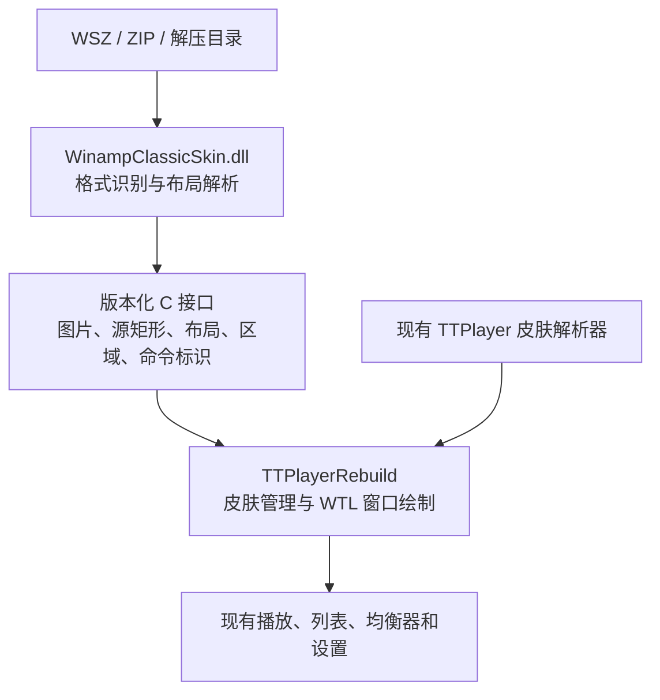

# Winamp 皮肤 DLL 接入可行性分析

分析日期：2026-09-18。依据当前 `rebuild` 与同级 `winamp` 目录中的源代码。
本文是静态代码审查和设计建议；尚未实现、编译或运行 Winamp 皮肤适配器。

## 1. 结论

**可以通过新增 DLL 支持 Winamp 皮肤，但重建版 EXE 必须先增加皮肤扩展接口。**

建议首先支持经典 Winamp 皮肤：由独立 DLL 解析图片、颜色和区域描述，转换为重建版可以绘制的布局；窗口、播放、列表数据和设置仍由重建版管理。

| 范围 | 可行性与边界 | 建议 |
| --- | --- | --- |
| 经典皮肤，通常为 `.wsz`、ZIP 或解压目录 | 主要是固定布局、位图图集、文本颜色和窗口区域；适合做独立适配器 | 首期实施 |
| Modern / Bento，通常为 `.wal` 或带现代 `skin.xml` 的包 | 依赖 Wasabi 界面服务、容器、布局和 MAKI 脚本运行时 | 单独立项评估 |
| 直接把 `gen_ff.dll` 放入当前 `AddIn` | 当前没有它需要的通用插件入口、IPC 和 Wasabi 服务宿主 | 不能直接使用 |
| 只把 `.wsz` 后缀改成 `.skn` | 容器相似，内容格式和绘制语义不同 | 无法解决兼容问题 |
| 普通版及 XP / Win7 版支持经典皮肤 | 可以按各自运行库构建适配器，但必须检查 DLL 及依赖的系统导入 | 两版共用适配逻辑、分别验证 |

扩展名只能用于初步筛选。Winamp 的 `Skins.cpp` 同时处理 ZIP、WSZ、WAL，并检查包内 `skin.xml`；最终必须根据内容识别皮肤类型。

## 2. 重建版目前具备什么

### 2.1 皮肤加载是 TTPlayer 专用流程

当前主要调用关系：

```text
PlayerWindow::LoadSkinPackage
  -> SkinPackage::Open
  -> PlayerWindow::LoadSkin
  -> SkinPackage::IsLegacyCompatible
  -> ExtractTo
  -> LegacySkin::Load
  -> ApplyLoadedSkin
```

源码依据：

- [skin_package.cpp](../src/skin/skin_package.cpp)：`IsLegacyCompatible()` 要求包中存在 `Skin.xml`。
- [skin.cpp](../src/skin/skin.cpp)：`ParseLegacySkinMetadata()` 接受 TTPlayer 的版本 2 元数据；`LegacySkin::Load()` 读取 `/skin/player_window` 等 TTPlayer 节点。
- [player_window.cpp](../src/ui/player_window.cpp)：`LoadSkin()` 直接创建 `LegacySkin`，没有按格式选择解析 DLL 的步骤。
- 同文件 `LoadSkinMenuCatalog()` 筛选 `.skn`、`.zip`，并调用 TTPlayer 元数据解析器。
- [player_window_file_intake.cpp](../src/ui/player_window_file_intake.cpp)：皮肤拖入安装分支识别 `.skn`。

因此，经典 WSZ 一般在缺少 `Skin.xml` 时就被拒绝；现代 Winamp 包即使包含同名文件，也不符合 TTPlayer 的 XML 结构。接入需要同时调整加载、目录扫描、元数据、预览和拖入安装，不能只放宽扩展名。

### 2.2 图像能力可复用，布局还不是通用皮肤模型

[skin_image.h](../include/ttplayer/skin/skin_image.h) 的 `SkinImage::Draw()` 已能指定源矩形，图像层也支持 BMP 和带透明度的图像，因此无需重新实现整套基础图像绘制。

但 [skin.h](../include/ttplayer/skin/skin.h) 和 `player_window.cpp` 仍包含 TTPlayer 的布局约定：

- `SkinElement` 以图片、帧数和控件名称描述按钮。
- `DrawElementFrame()` 按图片宽度等分，读取横向连续帧；没有为各个状态分别保存任意图集矩形。
- `HitTestSkin()`、`InvokeSkinAction()`、启用状态和选中状态根据 TTPlayer 控件名称处理。
- `PlaylistSkin` 包含列表分栏、分隔条及默认七格工具栏。
- `EqualizerSkin` 包含 TTPlayer 的均衡器、平衡和环绕控件布局。
- `LegacySkin` 封装了资源所有权和布局，目前没有给外部解析器直接构建完整布局的接口。

可将经典位图裁切、重排成现有帧条来验证主窗口原型；要完整呈现经典皮肤，则应增加明确的状态源矩形、布局类型等描述能力。

### 2.3 已有 Winamp 插件适配不等于已有皮肤宿主

当前存在三种相关入口：

| 位置 | 入口 | 用途 |
| --- | --- | --- |
| [plugin_manager.cpp](../src/plugins/plugin_manager.cpp) | `ttpGetSoundAddIn` | 原 TTPlayer AddIn |
| [winamp_dsp.cpp](../src/audio/winamp_dsp.cpp) | `winampDSPGetHeader2` | Winamp DSP 音效 |
| [mp3pro_source.cpp](../src/audio/mp3pro_source.cpp) | `winampGetInModule2` | mp3PRO 输入插件适配 |

本次在 `include`、`src` 中未发现 `winampGetGeneralPurposePlugin`、`WM_WA_IPC` 或 Wasabi `api_service` 的对应宿主实现。
上述音频插件适配可提供 DLL 加载和生命周期管理的参考，但不能直接承担现代皮肤宿主职责。

### 2.4 WTL 不构成接入障碍

[wtl_window.h](../include/ttplayer/ui/wtl_window.h) 的 `WindowBinding` 基于 `ATL::CWindowImpl`，将窗口消息交给现有处理函数。
皮肤绘制仍由重建版自己的代码完成，WTL 不负责解析 TTPlayer 或 Winamp 皮肤。

可以继续使用现有 WTL 窗口，让皮肤 DLL 提供布局和资源。需要明确窗口消息和资源所有权，避免另一套引擎未经协调替换主窗口过程。

## 3. Winamp 经典皮肤实际如何实现

经典皮肤代码主要在 Winamp EXE 内，不是在 `gen_ff.dll` 中：

| 源文件 | 已确认职责 |
| --- | --- |
| [Main.h](../../winamp/Src/Winamp/Main.h) | 主窗口基础尺寸 `275 × 116` |
| [Skins.cpp](../../winamp/Src/Winamp/Skins.cpp) | 包处理、现代皮肤识别、`region.txt`、`pledit.txt` |
| [draw.cpp](../../winamp/Src/Winamp/draw.cpp) | 主窗口图集、文字和数字图片、`viscolor.txt`、缺失图片回退 |
| [draw_main.cpp](../../winamp/Src/Winamp/draw_main.cpp) | 固定坐标绘制、按钮状态、折叠状态相关绘制、双倍尺寸 |
| [draw_eq.cpp](../../winamp/Src/Winamp/draw_eq.cpp) | `eqmain.bmp` 和均衡器绘制 |
| [draw_pe.cpp](../../winamp/Src/Winamp/draw_pe.cpp) | `pledit.bmp` 和播放列表绘制 |

主窗口图集包括 `main.bmp`、`cbuttons.bmp`、`monoster.bmp`、`playpaus.bmp`、`shufrep.bmp`、`numbers.bmp` / `nums_ex.bmp`、`volume.bmp`、`balance.bmp`、`text.bmp`、`posbar.bmp`、`titlebar.bmp`。

这些图片包含指定坐标的多个状态，并不遵循 TTPlayer 的统一四状态横向帧条。例如 `draw_eject()` 从 `cbuttons.bmp` 的固定区域读取普通或按下图片；标题栏按钮又使用另一组坐标。

`region.txt` 分别描述普通、WindowShade、均衡器和播放列表等窗口的多边形区域。WindowShade 是折叠为窄条的窗口模式，不能仅因重建版已有迷你模式，就认定两者布局和交互相同。

### 为经典皮肤补齐的内容

| 功能 | 重建版可复用部分 | 需要新增或适配 |
| --- | --- | --- |
| 主窗口、播放按钮 | HWND、GDI 绘制、播放命令 | 固定坐标、图集状态、激活/非激活标题栏 |
| 时间、标题、状态 | 播放时间、元数据、错误状态 | 位图字体、扩展数字、经典文字区域和滚动规则 |
| 进度、音量、平衡 | 播放和音频设置 | 图集取样、拖动命中、主窗口平衡控件绑定 |
| 随机、重复 | 当前播放模式和导航逻辑 | Winamp 两个开关与 TTPlayer 多种模式之间的明确映射 |
| 播放列表 | 歌曲数据、选择、滚动、拖放 | 经典单栏视图、边框拼接、底部按钮、尺寸步进 |
| 均衡器 | 十段均衡器和参数命令 | 控件图集、显示值与宿主参数之间的映射 |
| 窗口形状和折叠 | 区域设置、窗口组管理 | `region.txt`、各窗口 WindowShade 布局 |
| 频谱配色 | 重建版频谱数据和绘制能力 | `viscolor.txt` 配色及经典显示区域 |
| 缺失资源 | 默认皮肤回退机制 | 自有后备素材及逐项回退规则 |

经典列表模式应只改变视图，保留 TTPlayer 内部的多个播放列表；不能为隐藏左侧列表栏而删除列表或永久改写用户原有分栏设置。

随机、重复按钮应调用重建版已有播放策略，明确每种模式如何显示及切换。皮肤适配不应另建播放队列，覆盖已经恢复的单曲循环和随机索引行为。

均衡器外观兼容也不表示音频滤波曲线与 Winamp 完全相同。皮肤层应映射到宿主现有音频处理参数，音效一致性属于另一项工作。

Winamp 经典皮肤本身不定义 TTPlayer 歌词窗口。建议歌词、选项等界面继续使用重建版可用的皮肤或默认布局，并保留访问入口。

## 4. Modern / Bento 为什么不能直接加载 gen_ff.dll

[gen_ff/main.cpp](../../winamp/Src/Plugins/General/gen_ff/main.cpp) 导出的入口是 `winampGetGeneralPurposePlugin()`。
它在 `init()` 中执行的操作已经超出普通图片加载：

1. 向主窗口发送 `WM_WA_IPC / IPC_GET_API_SERVICE`，取得 Wasabi 服务管理器；缺失时返回初始化失败。
2. 取得配置文件和目录，查询语言服务。
3. 初始化 `wa2` 前端，注册内部 IPC 消息。
4. 使用 `SetWindowLongPtrW(..., GWLP_WNDPROC, ...)` 接管部分主窗口消息。
5. 注册选项页，连接媒体库和皮肤切换流程。

[wa2frontend.cpp](../../winamp/Src/Plugins/General/gen_ff/wa2frontend.cpp) 还取得频谱/VU 函数、播放列表 HWND 等 Winamp 专有接口。播放控制、列表与嵌入窗口分别散布在 `wa2core*`、`wa2playlist*`、`wa2wndembed*` 等适配代码中。

现代皮肤文件本身也使用不同的语言：

- [Winamp Modern/skin.xml](../../winamp/Src/resources/skins/Winamp%20Modern/skin.xml) 的根节点是 `WasabiXML`，包含多个布局和颜色文件。
- [Big Bento/skin.xml](../../winamp/Src/resources/skins/Big%20Bento/skin.xml) 使用 `WinampAbstractionLayer`，并加载 `.maki` 脚本。

[gen_ff.vcxproj](../../winamp/Src/Plugins/General/gen_ff/gen_ff.vcxproj) 列出 372 个 `ClCompile` 源文件项，其中 340 项路径位于 Wasabi 下；这是项目项统计，不代表已完成构建或每个配置都会编译所有项。
该项目还引用 `tataki`、`bfc`、`libmp4v2`，并延迟加载 `tataki.dll`。

因此，现代皮肤需要完整运行时和宿主适配。仅补一个导出函数、伪造少量 IPC 返回值、解析 XML 背景图，都不能称为 Modern / Bento 兼容。
技术上可以封装在 DLL 中，但必须单独评估脚本对象、事件、服务、容器与媒体库嵌入等覆盖范围。

## 5. 推荐的 DLL 边界

下图为建议结构，模块名尚未实现：



建议增加专用皮肤模块目录和管理器，避免混入只识别 `ttpGetSoundAddIn` 的 AddIn 扫描。
宿主根据包内容选择内置 TTPlayer 解析器或经典 Winamp 解析器，再应用布局。

接口应包含以下约定：

- 版本号、结构体大小、能力标志，以及明确的调用约定。
- 格式探测、元数据读取、皮肤实例创建、布局/资源读取和实例销毁。
- 字符串使用明确编码及长度；分配和释放由同一模块完成。
- DLL 边界不直接传递 `LegacySkin`、`SkinImage`、`std::wstring`、`std::vector`、`shared_ptr` 或 C++ 异常。
- 宿主执行播放命令并提供状态；DLL 不直接访问播放器内部 C++ 对象。
- 后台可做包读取和布局解析；窗口绑定、输入及绘制提交在 UI 线程进行。

`SkinImage` 含有 `shared_ptr`，当前普通版和旧系统版还使用不同运行库配置，因此直接把现有 C++ 对象作为插件 ABI 会增加耦合和内存释放风险。

建议新增宿主侧中间布局构建接口，再由宿主接收 DLL 的描述数据。临时生成 TTPlayer `Skin.xml` 和重排 BMP 可以用于早期原型，但不能作为完整经典皮肤兼容的验收标准。

### 资源生命周期

当前 `LoadSkin()` 已处理旧皮肤保活、窗口重绑定、失败回滚及歌词资源解绑。扩展后应保持同样的事务边界：

1. 新皮肤解析、尺寸与资源校验成功后再切换。
2. 旧窗口仍引用的图像和皮肤实例保持有效。
3. 完成所有窗口重绑定及回调清理后，再释放旧实例。
4. 模块存在活动实例或未结束任务时不卸载 DLL。
5. 加载失败恢复原皮肤，且不改写有效的皮肤选择配置。

这也有利于保留现有任务栏预览、SMTC 和窗口组逻辑依赖的主窗口身份。

## 6. XP / Win7 版本

经典位图皮肤可以使用适合旧系统的 GDI 路径，新增 DLL 本身不要求 WinRT 或现代图形运行时。
但是否兼容取决于实际导入和依赖，不能由文件扩展名、编译宏或“使用 DLL”推断。

当前 [CMakeLists.txt](../CMakeLists.txt) 的旧系统导入审计针对 `TTPlayerRebuild.exe`。
增加皮肤模块后，需要将模块及其依赖纳入审计和分发，避免再次引入 `CreateFile2` 等旧系统缺失的静态导入。

建议：

- 普通版与 XP / Win7 版使用同一套经典皮肤逻辑，按各自工具链和运行库配置产出。
- 模块位数与宿主一致；当前发布流程的两版是 x86。
- DLL 的 CRT、静态 TLS、图片/解压依赖和加载方式均需检查，沿用当前旧系统工程的兼容边界。
- 在 XP 和 Win7 上验证首次加载、播放中换肤、重复切换、缺失模块回退及退出清理。

本地 `gen_ff` 工程使用 `v142`，并定义 `_WIN32_WINNT=0x0601` / `WINVER=0x0601`。该工程配置不能作为 XP 支持依据，也不能单凭这些宏断言其全部依赖在 Win7 一定可用。

## 7. 本地源码的分发限制

本地 [Winamp LICENSE.md](../../winamp/LICENSE.md) 为 WCL 1.0.1：第 3 节限定修改供私人使用，第 5 节明确限制修改版的源码及二进制分发，并限定官方维护者分发。

因此，这份源码可以用于本次分析，但不能因其已经公开，就把直接移植出来的 DLL 当成可以随本项目 GitHub / Gitee Release 分发的组件。
如采用其中代码，需要核实对应文件适用的许可和授权；第三方代码、皮肤图片和脚本也应分别核对。

建议优先独立实现经典皮肤格式适配，并提供自有后备素材。独立实现的具体分发条件仍取决于实际采用的代码和素材；本分析没有认定任何复制或改写方式自动获得授权。

## 8. 建议实施顺序与验收边界

1. **皮肤扩展基础**：增加版本化接口、模块加载、格式识别、中间布局构建，以及加载失败回退；现有 TTPlayer 皮肤走内置解析器。
2. **经典主窗口**：支持 WSZ/ZIP/目录、标准图集、播放按钮、进度、音量、平衡、标题与时间；贯通皮肤菜单、预览、安装和重启恢复。
3. **经典附属窗口**：适配单栏播放列表、均衡器、标题栏状态、缩放、窗口区域、WindowShade 和窗口组联动。
4. **兼容细节及两版验证**：补齐位图字体、可选资源、频谱配色等；验证缺图、损坏包、超大尺寸、资源释放和普通/旧系统构建。测试代码保留在 `rebuild/tests`，不加入 Release，也不增加 Actions 测试步骤。
5. **另行评估现代皮肤**：在运行时覆盖范围、宿主接口和源码授权条件明确后，再决定是否增加 Wasabi / MAKI 支持。

至少选取普通矩形、异形区域、缺少可选图片和带 WindowShade 的经典皮肤进行实际对照。
对照范围应包括空列表、播放错误、播放中切换、标题栏激活状态、列表滚动/调整尺寸、均衡器、循环/随机按钮、关闭重开及反复卸载，不能以一张主窗口截图作为兼容完成的依据。

**推荐首个交付目标：可选经典 Winamp 皮肤 DLL，覆盖主窗口、播放列表和均衡器，并对普通版及 XP / Win7 版分别验证。Modern / Bento 不计入首期兼容承诺。**
