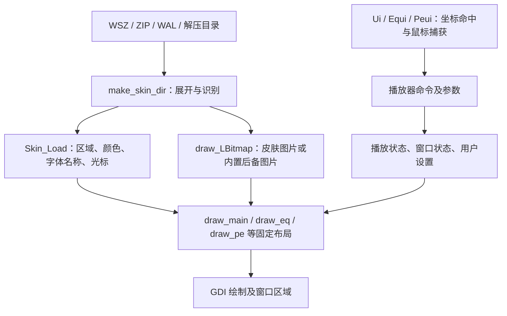

# Winamp 经典 WSZ 控件解析与当前 DLL 对照

> 本文为修复前的源码对照记录。后续修复、千千静听功能替代关系和暂无替代项，请以 [当前实现状态表](NATIVE_FUNCTION_MAPPING.md) 为准。

分析日期：2026-09-19。依据本地 `winamp/Src/Winamp`、`winamp/Src/Plugins/General/gen_ml`、`waskin/src` 及重建版宿主接口。

这是对修复前源码的静态分析，包含资源名、裁切坐标、状态和输入处理；不是对所有第三方皮肤的运行兼容性认证。下文保留当时的差异记录，后续结果见上述状态表。

## 1. 结论与分析范围

**经典 WSZ 是资源包。Winamp 在程序中规定控件布局、切图坐标、状态和命中规则，WSZ 提供这些规则需要的图片、颜色、字体名称、光标和窗口区域。**

因此，“能打开 WSZ”“能显示三张窗口背景”“能操作主要按钮”和“完整兼容经典皮肤”是不同的完成程度。当前 `ttp_waskin.dll` 已实现三窗口基础兼容，但尚未完成全部经典控件及状态。

本文覆盖：

- 主窗口的普通、折叠、双倍尺寸路径。
- 十段均衡器、预放大、Auto、预设、曲线、快捷归零及折叠控制。
- 播放列表边框、列表、滚动、底部按钮组、统计、迷你播放按钮和折叠模式。
- 频谱／示波器、区域、光标及缺失资源回退。
- 经典视频窗口、通用插件窗口和 `genex.bmp` 控件资源。

Modern / Bento 的 XML、Wasabi 布局及 MAKI 脚本另属一套运行时。第三方插件自行约定的额外文件也不能仅凭 `.wsz` 后缀推导出含义。

### 主要源码入口

| 文件 | 关键函数／职责 |
| --- | --- |
| [Skins.cpp](../../winamp/Src/Winamp/Skins.cpp) | `make_skin_dir`、`Skin_Load`、`Skin_LoadCursors`、`Skin_LoadFreeformColors`；包展开、配置与区域 |
| [draw.cpp](../../winamp/Src/Winamp/draw.cpp) | `draw_LBitmap`、`draw_init`、`draw_reinit_plfont`、`getXYfromChar`；位图、后备资源、字体、可视化配色 |
| [draw_main.cpp](../../winamp/Src/Winamp/draw_main.cpp) / [Ui.cpp](../../winamp/Src/Winamp/Ui.cpp) | 主窗口切图与鼠标状态机 |
| [main_mouse.cpp](../../winamp/Src/Winamp/main_mouse.cpp) | 右键区域菜单、双击及坐标缩放 |
| [draw_eq.cpp](../../winamp/Src/Winamp/draw_eq.cpp) / [Equi.cpp](../../winamp/Src/Winamp/Equi.cpp) | 均衡器绘制、滑块与按钮输入 |
| [draw_pe.cpp](../../winamp/Src/Winamp/draw_pe.cpp) / [Peui.cpp](../../winamp/Src/Winamp/Peui.cpp) | 播放列表切片、文字、底部按钮展开与列表输入 |
| [draw_sa.cpp](../../winamp/Src/Winamp/draw_sa.cpp) / [Set.cpp](../../winamp/Src/Winamp/Set.cpp) | 频谱／示波器绘制、区域应用、可视化子窗口布局 |
| [draw_embed.cpp](../../winamp/Src/Winamp/draw_embed.cpp) / [skinWindow.cpp](../../winamp/Src/Winamp/skinWindow.cpp) | 通用插件窗口边框和标题字体 |
| [draw_vw.cpp](../../winamp/Src/Winamp/draw_vw.cpp) / [videoui.cpp](../../winamp/Src/Winamp/videoui.cpp) | 经典视频窗口 |
| [wa_dlg.h](../../winamp/Src/Winamp/wa_dlg.h) / [skinnedscrollwnd.cpp](../../winamp/Src/Plugins/General/gen_ml/skinnedscrollwnd.cpp) | `genex.bmp` 的按钮、颜色、滚动条 |
| [skin.cpp](../src/skin.cpp) / [ttp_skin_plugin.h](../include/ttp_skin_plugin.h) | 当前 DLL 的加载、切图、命中和宿主接口 |

下文 `D(x,y,w,h)` 表示窗口中的绘制矩形；`S(x,y,w,h)` 表示位图中的取样矩形。均为 1 倍逻辑像素。绘制矩形不一定等于鼠标命中矩形。

## 2. 从 WSZ 到控件的实际流程

### 2.1 包名与目录

`Skins.cpp::make_skin_dir()` 同时接受 `.zip`、`.wsz`、`.wal`，其他路径作为目录处理。压缩包会先查找现代皮肤的 `skin.xml`，再走对应展开分支。

经典分支只提取 `.txt`、`.cur`、`.bmp`、`.ini`，并取条目最后一级文件名写入临时目录。因此经典资源即使在包内子目录中，也可能被展开为同一层的文件。

当前 DLL 的实现不同：

- 在内存中解析 ZIP，不落地展开；支持 Stored／DEFLATE 和 CRC 校验。
- 将文件名规范化为小写；有一个明确的资源根目录。
- 根目录没有 `main.bmp` 时，查找唯一的 `*/main.bmp`，其所在路径成为统一前缀。
- 不会像 Winamp 经典展开分支那样把不同目录中的图片全部扁平化合并。
- 任意层级发现 `skin.xml` 就拒绝现代包；这是当前插件主动限定的支持范围。

依据：[archive.cpp](../src/archive.cpp) 的 `Archive::Archive`、`Has`、`Read`。这说明包的目录布局本身也是兼容性条件。

### 2.2 图片缺失时的回退

`draw.cpp::draw_LBitmap()` 先从皮肤目录 `LoadImageW`，失败后按调用者给出的资源 ID 加载内置位图。例外需要按调用点区分：

| 资源 | Winamp 行为 |
| --- | --- |
| `main.bmp`、`cbuttons.bmp`、`text.bmp`、`pledit.bmp` 等 | 皮肤文件缺失或加载失败，使用对应内置资源 |
| `nums_ex.bmp` | 优先使用；没有时转为 `numbers.bmp`，后者还有内置回退 |
| `balance.bmp` | 自定义皮肤中缺失时复用已经加载的音量图 `volume.bmp` |
| `eqmain_iso.bmp` | ISO 频段模式先尝试它，再尝试 `eqmain.bmp`，最后使用对应内置均衡器 |
| `eq_ex.bmp` | 有独立后备资源，并影响是否提供 EQ 折叠按钮 |
| `genex.bmp` | 通过 IPC 获取，加载也有内置后备 |

**`main.bmp` 并不是 Winamp 经典皮肤必须包含的唯一有效性凭据。** 当前 DLL 的 `Probe` 和 `Skin` 构造要求它存在且至少为 `275×116`，所以会拒绝 Winamp 可以用默认主窗口补齐的部分皮肤。

DLL 的可选图片缺失时通常跳过绘制或用简单文字／色块补位；可选图片存在但解码抛错时会中断实例创建。这与 Winamp 的逐资源回退不同。`Probe` 只验证主图片，也不等于已经验证所有可选资源。

## 3. 资源清单

下列尺寸来自本地 Winamp 附带 BMP 的文件头，**用于对照，不代表必须严格等于该尺寸**；兼容实现应检查实际访问的源矩形是否可用。

| 资源 | 本地素材尺寸 | 使用内容 |
| --- | --- | --- |
| `main.bmp` | 275×116 | 主窗口普通背景 |
| `titlebar.bmp` | 344×87 | 激活／非激活标题、折叠标题、窗口按钮、侧边快捷区、折叠进度 |
| `cbuttons.bmp` | 136×36 | 上一首、播放、暂停、停止、下一首、打开文件 |
| `shufrep.bmp` | 92×85 | 随机、重复、EQ／PL 显示开关 |
| `posbar.bmp` | 307×10 | 进度背景和普通／按下滑块 |
| `volume.bmp`、`balance.bmp` | 各 68×433 | 28 档轨道背景、普通／按下滑块 |
| `numbers.bmp` | 99×13 | 大时间数字及清空单元 |
| `nums_ex.bmp` | 本地默认资源未提供 | 可选扩展数字；代码另访问 `S(99,0,9,13)` 的负号 |
| `text.bmp` | 155×74 | 位图字形、小时间数字；系统字体回退时也从图中取色 |
| `playpaus.bmp` | 42×9 | 播放、停止、暂停、空状态及播放同步指示 |
| `monoster.bmp` | 58×24 | 单声道／立体声亮暗状态 |
| `eqmain.bmp`、`eqmain_iso.bmp` | 各 275×315 | EQ 普通窗口、滑块、开关、预设、曲线素材 |
| `eq_ex.bmp` | 275×82 | EQ 折叠窗口及相关按钮／滑块 |
| `pledit.bmp` | 280×186 | PL 边框、滚动、底部展开按钮、折叠条 |
| `gen.bmp` | 194×109 | 通用插件窗口边框、可变宽标题字形 |
| `genex.bmp` | 130×75 | 通用按钮、滚动条及控件配色像素 |
| `video.bmp` | 234×119 | 视频窗口边框及底部五按钮 |

配置资源为 `pledit.txt`、`region.txt`、`viscolor.txt`、`colors.ini`，以及第 10 节列出的 `.cur`。当前 DLL 加载 16 个命名 BMP（包括新增的 `video.bmp`），尚未加载 `eqmain_iso.bmp`、`gen.bmp`、`genex.bmp`。

`mb.bmp` 虽然也存在于资源目录，但当前 `draw_mb.cpp` 只剩 include，`Skins.cpp` 的 `mb.ini` 行为位于 `#if 0` 中。不能仅凭遗留文件，认定此版本仍完整实现旧 MiniBrowser 控件。

## 4. 主窗口全部控件组

依据 `draw_main.cpp`、`Ui.cpp`、`main_mouse.cpp`；窗口基础尺寸 `275×116`。

### 4.1 绘制与状态图集

| 控件 | 目标位置 | 来源与状态 |
| --- | --- | --- |
| 背景 | D(0,0,275,116) | `main.bmp` 左上区域 |
| 标题栏 | D(0,0,275,14) | `titlebar.bmp`，源 x=27；普通激活／非激活 y=0／15，折叠 y=29／42；另有 egg 分支 y=57／72 |
| 主菜单按钮 | D(6,3,9,9) | `titlebar.bmp`，x=0，普通／按下 y=0／9 |
| 最小化 | D(244,3,9,9) | 同图 x=9，y=0／9 |
| 关闭 | D(264,3,9,9) | 同图 x=18，y=0／9 |
| 折叠／展开 | D(254,3,9,9) | 同图普通／按下 x=0／9，非折叠 y=18、折叠 y=27 |
| 上一首、播放、暂停、停止、下一首 | 从 D(16,88) 起 | `cbuttons.bmp` 源 x=0、23、46、69、92；前四宽 23，末个宽 22，高 18；普通／按下 y=0／18 |
| 打开文件 | D(136,89,22,16) | 同图源 x=114，普通／按下 y=0／16 |
| 随机 | D(164,89,47,15) | `shufrep.bmp` 源 x=28，y=`开启?30:0` + `按下?15:0` |
| 重复 | D(210,89,28,15) | 同图源 x=0，y 与随机同规则 |
| EQ 显示开关 | D(219,58,23,12) | 同图源 x=0／46，y=61／73，分别表示按下与打开状态 |
| PL 显示开关 | D(242,58,23,12) | 同图源 x=23／69，y=61／73 |
| 进度 | D(16,72,248,10) | `posbar.bmp` 背景 S(0,0,248,10)；29×10 滑块普通 x=248、按下 x=278 |
| 音量 | D(107,57,68,13) | `volume.bmp` 背景 y=`floor(volume×27/255)×15`；14×11 滑块源 y=422，按下 x=0、普通 x=15 |
| 平衡 | D(177,57,38,13) | `balance.bmp`，背景源 x=9、y=`floor(abs(pan)×27/127)×15`；滑块同上 |
| 大时间数字 | x=48、60、78、90，y=26，单格 9×13 | `numbers.bmp`／`nums_ex.bmp` 源 x=`digit×9`；x=36 可显示百分钟位，另处理清空和负号 |
| 播放状态 | D(26,28,9,9) | `playpaus.bmp` 源 x：播放 0、暂停 9、停止 18、空 27；左侧还有正常／失同步播放指示 x=36／39 |
| 单声道 | D(212,41,28,12) | `monoster.bmp` 源 x=29，亮／暗 y=0／12 |
| 立体声 | D(239,41,29,12) | 同图源 x=0，亮／暗 y=0／12 |
| 歌名 | 位图方式从 (111,27) 起 | `text.bmp`，5×6 字形；另有系统字体路径和像素滚动 |
| 码率／采样率 | (111,43)、(156,43) | `text.bmp` 小字形；码率超过三位时有 H／C 特殊表示 |
| 频谱／示波器 | D(24,43,76,16) | `draw_sa.cpp` 动态生成，配色来自 `viscolor.txt`；非背景贴图 |
| 左侧 O/A/I/D/V 快捷区 | D(10,22,8,43) 附近 | `titlebar.bmp` x=304 以后的区域；菜单、置顶、文件信息、双倍尺寸、可视化菜单 |
| 右下闪电标志 | 命中约 (253,91)～(265,105) | 外观来自背景，`Ui.cpp::do_icon` 发出 `WINAMP_LIGHTNING_CLICK` |

进度滑块位移为 `floor(position×219/256)`；音量滑块位移为 `floor(volume×51/255)`；平衡滑块位移为 `clamp(pan×12/127+12,0,24)`。因此图片高度看似很长，是因为它包含多档背景；不能把整个文件缩放成一根轨道。

### 4.2 命中、捕获和业务命令

`Ui.cpp::ui_handlemouseevent()` 优先处理进度、音量、平衡、歌名拖动，然后处理播放按钮、模式、打开、窗口开关和侧栏，最后处理标题按钮与窗口拖动。

必须保留以下区别：

1. **绘制矩形和命中矩形不同。** 例如进度绘制为 (16,72,248,10)，普通鼠标命中约为 (18,73)～(263,81)；直接用图像矩形替代并不精确。
2. **按住滑块时保存抓取偏移。** 不是每次鼠标移动都强制把滑块中心移到鼠标下。
3. **进度拖动先更新预览。** 显示目标时间、比例，通常释放后定位；Shift 拖动有持续定位分支。不可定位、未播放、隐藏条目等状态有门控。
4. **音量／平衡会临时改写歌名显示区。** 释放后恢复标题；平衡还存在中心吸附及 Shift 细调规则。
5. **播放按钮支持修饰键。** Shift／Ctrl 选择不同命令；打开按钮的普通、Shift、Ctrl 分别是文件、目录、URL。
6. **右键菜单按控件区分。** 歌名、时间、可视化、各播放按钮、进度、随机、重复、EQ、PL 都有对应分支。不是所有区域都弹同一个主菜单。
7. **随机和重复是 Winamp 的两个独立开关。** 重建版是五种互斥播放模式；应明确映射，不能把皮肤开关照搬为另一套播放队列。

### 4.3 主窗口折叠与双倍尺寸

折叠后高度为 14，源自 `titlebar.bmp` 专门的两条标题，而非把 116 高的主界面缩小。

| 折叠控件 | 原代码处理 |
| --- | --- |
| 时间 | 使用 `text.bmp` 的小数字，约 x=126～157、y=4；支持剩余时间和百分钟 |
| 频谱 | D(79,5,38,5) |
| 六个迷你播放／打开按钮 | `Ui.cpp::do_timedisplay` 在约 x=168～224、y=2～11 分区命中 |
| 微型进度 | D(226,4,17,7)，背景源 S(0,36,17,7)，滑块宽 3，按位置从 x=17／20／23 取样 |
| 菜单、最小化、关闭、展开 | 仍有自己的命中与状态图；不能把整条都当成拖动标题 |

双倍尺寸由绘制、输入坐标和窗口区域共同处理：输出放大 2 倍，鼠标转换回逻辑坐标，多边形点也随之放大；EQ 是否跟随还有独立配置。单独拉伸背景不足以恢复此模式。

## 5. 文字和时间的解析细节

### 5.1 `text.bmp` 字形不是 ASCII 顺序

`draw.cpp::getXYfromChar()` 使用手工映射：

- A～Z／a～z：源 y=0、x=`字母序号×5`。
- 0～9：源 y=6、x=`数字×5`。
- y=6 的第 10 格是 `\1` 专用字符；第 11 格才是 `.`，之后为 `:`、`(`、`)`、`-` 等。
- `[`、`{`、`<` 共用一格；`]`、`}`、`>` 共用一格；`~`、`^` 共用一格。
- `?`、`*` 等在第三行 y=12；另有带变音字母的映射。

**当前 DLL 有可直接由代码确认的偏移错误。** `Skin::Text()` 的第二行字符串是 `0123456789.:...`，省略了第 10 格，使点号及后续标点向左错一格。例如冒号读取 x=55，而 Winamp 的冒号在 x=60。它还缺少第三行和部分别名映射。

### 5.2 系统字体回退仍受皮肤控制

`draw_reinit_plfont()` 从 `text.bmp` 的 (150,4) 取背景色，再扫描左上 20×6 像素，选出与背景距离最大的颜色作为前景色。主标题使用系统字体时仍沿用这些颜色。

播放列表字体来自用户自定义字体或 `pledit.txt` 的 `Font`，并使用配置字号、字符集及实际 `TEXTMETRIC` 行高。当前 DLL 固定 Tahoma、字号 -11、列表行高 13；主标题回退颜色也使用列表当前项颜色，因此不完全一致。

### 5.3 滚动与时间状态

- 原标题按实际像素宽度决定是否滚动，位图文字支持首字形内的像素偏移；鼠标可拖动文字，操作音量／进度时暂停标题滚动。
- 当前 DLL 用 `title.size()>30` 判定，每四个 100ms tick 前进一个字符；中文按字符数而非像素宽度处理。
- 原时间支持清空、暂停闪烁、已过／剩余、负号、超过 99 分钟，以及折叠和 PL 的小数字显示。
- 当前 DLL 普通窗口只绘制四位时间，百分钟位未实现；负号使用系统文字，折叠显示直接取 `position_ms`，未沿用剩余时间状态。

## 6. 均衡器的全部控件组

依据 `draw_eq.cpp::draw_eq_*` 和 `Equi.cpp::do_*`。

| 控件 | 目标／资源规则 | 交互 |
| --- | --- | --- |
| 普通背景 | `eqmain.bmp` 顶部 275×116；ISO 模式优先 `eqmain_iso.bmp` | 背景不定义频段业务 |
| 标题栏 | D(0,0,275,14)，源 y=134／149 | 激活／非激活，拖动窗口 |
| 关闭 | D(264,3,9,9)，`eqmain.bmp` 源 x=0，y=116／125 | 关闭 EQ 窗口 |
| 折叠按钮 | 普通／折叠状态组合使用 `eqmain.bmp`、`eq_ex.bmp` | `enable_eq_windowshade_button` 影响可用性 |
| On | D(14,18,25,12)，源 x=`10+开启×59+按下×118`，y=119 | 开关均衡器 |
| Auto | D(39,18,33,12)，源 x=`35+开启×59+按下×118`，y=119 | 自动加载与曲目关联的 EQ 设置 |
| Presets | D(217,18,44,12)，源 (224,164／176) | 打开预设菜单 |
| Preamp | 轨道 D(21,38,14,63) | 总预放大 |
| 10 个频段 | x=`78+18×i`，y=38，14×63 | 频段滑块 |
| EQ 曲线 | D(86,17,113,19)，背景源 (0,294) | 曲线随参数变化，由样条插值生成 |
| Preamp 水平线 | 取源 y=314 的一行 | 表示预放大位置 |
| +12／0／-12 快捷区 | x=42～67；y=33～42、65～74、92～101 | 同时将十个频段置为 0／31／63，保持 Preamp 独立 |
| 折叠音量 | `eq_ex.bmp` 折叠背景上的微型滑块 | 命中 x=61～162、y=3～11 |
| 折叠平衡 | 同上 | 命中 x=163～206、y=3～11，带中心吸附 |

滑块值实际夹在 0～63，显示量约为 `(value-31.5)/31.5×(-12 dB)`。图集帧为 `n=27-floor(value×28/64)`，前 14 帧位于 y=164，后 14 帧位于 y=229；每格源 x 间距 15、取宽 14。11×11 滑块源为 (0,164／176)。

原滑块纵坐标为 `89-floor((63-value)×52/64)`，不是简单把 63 高轨道线性铺满。输入还保存抓取偏移、支持中心吸附和跨相邻频段拖动。

曲线使用 `plSplineGetPoint` 插值，在源 x=115 的颜色列取样；并非直接画一条固定颜色的折线。ISO 图只改变皮肤频段标注和相应选择，不能替代音频引擎的频率配置。

### 当前 DLL 的对应情况

- On、Presets、11 个滑块已有宿主命令映射。
- Auto 只绘制关闭图，没有命中、状态字段或命令。
- EQ 曲线、预放大线、三个快捷区尚未绘制／接入。
- 没有 `eqmain_iso.bmp` 的加载分支。
- 普通滑块取值先映射为整数 -12～12，精度和端点取整与 Winamp 不同；当前绘制公式为 `39+pos×51/63`，例如端点位于 y=39／90，原版为 y=38／89。
- EQ 折叠模式只贴背景；音量／平衡、折叠按钮状态和原图缺失时的可用性策略不完整。
- “音效滤波与 Winamp 相同”不在皮肤适配范围；应该继续调用重建版的音频引擎。

## 7. 播放列表的全部控件组

播放列表是动态尺寸界面，W／H 表示当前宽高，普通模式最小 `275×116`。`Peui.cpp::do_size()` 在未启用自由缩放时将宽度向上对齐 25、高度向上对齐 29；折叠高度保持 14，可横向调整宽度。

### 7.1 边框、标题、列表与滚动

| 区域 | Winamp 切片／布局 |
| --- | --- |
| 顶部左角 | `pledit.bmp` S(0,state,25,20)，state=0／21 |
| 顶部标题 | S(26,state,100,20)，居中并结合 25 像素重复块 |
| 顶部重复块 | S(127,state,25,20)，有 12／13 半块和余量处理 |
| 顶部右角 | S(153,state,25,20) |
| 左边框 | S(0,42,12,29)，纵向重复；不足一块时按原代码处理余量 |
| 右边框 | S(31,42,5,29) 与 S(44,42,7,29)，中间保留滚动轨道 |
| 底部左块 | S(0,72,125,38) |
| 底部填充 | S(179,0,25,38)，重复拼接 |
| 宽列表可视化块 | W≥350 时使用 S(205,0,75,38)；内嵌可视化区约 72×16 |
| 底部右块 | S(126,72,150,38) |
| 列表文字区 | 左 12、右 W-20、首行 y=22；行高来自字体，行数 `floor((H-60)/fontHeight)` |
| 滚动滑块 | 8×18，源普通 (52,53)、按下 (61,53)，目标 x=W-15 |
| 滚动轨道 | 高 H-58，滑块行程 H-76；范围是总行数减可见行数 |
| 小滚动箭头 | x=W-15～W-7，底部 y=H-36～H-32、H-31～H-27 |
| 关闭／折叠 | D(W-11,3,9,9)、D(W-20,3,9,9)，独立普通／按下图 |

曲目时长单独测量并右对齐，支持未知时长、序号配置、播放高亮、选择高亮和文字方向。行选择与当前播放不是同一个状态。

### 7.2 底部五组展开按钮

这些不是普通系统菜单按钮。`draw_pe_addbut/rembut/selbut/miscbut/iobut()` 从 `pledit.bmp` 绘制向上展开的多行选项，再由 `Peui.cpp` 管理捕获和命令。

每个选项通常为 22×18，组内普通／选中源 x 差 23，左侧另有 3 像素边缘。三行素材源 y 从下到上为 149、130、111；REM 的第四行额外使用 y=168。

| 组 | 普通／按下源 x | 目标 x | 具体命令 |
| --- | --- | --- | --- |
| ADD | 0／23 | 14 | 文件、目录、URL |
| REM | 54／77 | 43 | 删除所选、仅保留所选、清空、额外删除菜单 |
| SEL | 104／127 | 72 | 全选、全不选、反选 |
| MISC | 154／177 | 101 | 文件信息相关菜单、排序菜单、杂项菜单 |
| LIST | 204／227 | W-44 | 打开列表、保存列表、清空列表 |

按钮弹出与完成选择还受 `config_ospb` 影响，不能用一次点击统一代替。

### 7.3 底部其他控件与折叠

- 迷你六按钮：约 x=W-144～W-91、y=H-15～H-8，支持播放相关命令和修饰键。
- 小时间：`text.bmp` 数字，约 x=W-86、y=H-15；点击切换已过／剩余。
- 统计文本：约 x=W-143、y=H-28，18 个位图字符；计算“选中曲目总时长／整个列表总时长”，未知时长会带 `+`／`?`。
- 折叠标题：左 25、中央 25 像素重复、右 50 的专用素材；显示当前曲目及其时长，无曲目时使用默认文字。
- 普通列表支持选择范围、Ctrl 多选、拖动及相应滚动；折叠列表仍有独立关闭、展开和横向缩放。

### 当前 DLL 的对应情况

- 基本边框、单选行、播放行高亮、时长、滚轮、滚动条和双击播放已实现。
- 首行目前 y=20、固定行高 13；原实现首行 y=22，按实际字体度量计算行数。
- ADD 简化为打开文件；REM 简化为删除单行；SEL／MISC／LIST 及底部其他区域多被合并为打开主菜单，没有完整展开状态机。
- 底部统计目前是 `N tracks`，不是选中／总时长；底部小时间、六按钮和宽列表频谱未实现。
- 滚动条仅使用普通图；标题按钮按下图未补齐。
- 加宽后的底部填充、折叠中间段整块拉伸，不能保留原版重复纹理；未实现 W≥350 的额外 75 像素块。
- 调整尺寸使用自由像素尺寸，未按 Winamp 的条件执行 25／29 步进；折叠横向缩放未接入。
- 只有单个 `selected` 行，没有 Winamp 的多选集合和完整键盘／拖放状态。是否复用宿主的选择模型，需在实现时设计接口。

## 8. 配置文件的解析

### 8.1 `pledit.txt`

| 节／键 | 意义 | 当前 DLL |
| --- | --- | --- |
| `[Text] Normal` | 普通条目文字色 | 已读取 |
| `Current` | 当前播放条目文字色 | 已读取 |
| `NormalBG` | 普通背景 | 已读取 |
| `SelectedBG` | 所选条目背景 | 已读取；默认值有差异 |
| `mbFG`、`mbBG` | 视频／旧浏览器相关信息文字、背景 | 未使用 |
| `Font` | UTF-8 字体名，原版转换为 Unicode 后创建字体 | 未使用 |
| `[Misc] UseGenNums` | 是否启用 `gen.bmp` 的数字标题字形 | 未使用 |

原版默认所选背景为 RGB(0,0,198)，当前 DLL 为 RGB(0,0,128)。原版色值使用允许可选 `#` 的十六进制解析；DLL 当前要求恰好六位有效十六进制字符，接受范围更窄。

### 8.2 `region.txt`

当前 Winamp 实际启用四个节：`Normal`、`WindowShade`、`Equalizer`、`EqualizerWS`。

每节的 `NumPoints` 给出各多边形点数，`PointList` 给出有符号整数 x,y 坐标序列。原代码允许空格、Tab、逗号分隔，检查坐标数量为偶数且等于总点数的两倍。有效数据最终经 `CreatePolyPolygonRgn(..., WINDING)` 和 `SetWindowRgn` 应用；双倍模式还要变换坐标。

**重要更正：此源码中 `[Playlist]`／`[PlaylistWS]` 的读取在 `Skins.cpp` 被注释，`Set.cpp` 的播放列表区域应用也整段被注释。** 保留的数据结构和查询分支不是启用证据。

当前 DLL 对三个窗口共六种模式都尝试解析区域，所以播放列表多边形属于额外行为，并非与此 Winamp 版本一致。今后对齐时应决定是否保留这种扩展，并单独说明。

### 8.3 `viscolor.txt`

读取最多 24 行，每行三个十进制 RGB 分量，逗号／空格／Tab 可作分隔；缺失时使用默认调色板。

| 索引 | 用途 |
| --- | --- |
| 0 | 背景 |
| 1 | 背景网格点 |
| 2～17 | 频谱不同高度的颜色 |
| 18～22 | 示波器颜色层次 |
| 23 | 频谱峰值 |

`draw_sa.cpp` 还处理频谱柱／细线、峰值下落、示波器样式、折叠与双倍尺寸。图片和颜色只定义外观，实时音频数据来自播放器。

当前 DLL 完全没有读取这个文件，也没有频谱／波形绘制路径；现有 `TtpSkinState` 没有对应音频可视化数据接口。仅补文件解析不会使频谱自动出现。

### 8.4 `colors.ini`

`Skin_LoadFreeformColors()` 要求入口为 `[colors]`，逐项读取名称和颜色；颜色支持 `r,g,b` 或 `#RRGGBB`，注册到 Wasabi 调色板。经典皮肤也能借此影响支持该调色板的菜单／插件控件，不能把文件名带 freeform 的函数理解为只处理 WAL。

当前 DLL 没有解析该文件。若补齐，应定义可映射的颜色集合；这不等于需要在 DLL 中运行现代皮肤引擎。

## 9. 三个主窗口以外的控件

### 9.1 `gen.bmp`：通用插件窗口

`draw_embed.cpp` 按 25×20 标题块、29 高边条、14 高底边拼接通用插件窗口，并处理关闭、激活状态和禁止缩放标志。

标题字形是可变宽的：`draw_init()` 以 y=90 的分隔色扫描 26 个字母边界，以 y=74 扫描 12 个数字／符号边界；绘制从 y=88／96 取字母、y=72／80 取数字等。数字开关由 `UseGenNums` 控制。

这部分确实存在“根据图片像素推导字形宽度”的解析，不能用 `text.bmp` 固定 5 像素字宽代替。

### 9.2 `genex.bmp`：按钮、滚动条、列表等控件配色

通过 `IPC_GET_GENSKINBITMAP` 交给 `WADlg`／媒体库控件使用。

- 普通按钮源为 47×15，按下图 y=15；四角／边缘保留 4 像素，中间拉伸。焦点框、禁用文字色由绘制逻辑补出。
- 上／下箭头为 14×14，普通源 (0,31)／(14,31)，按下源 (28,31)／(42,31)。左右箭头对应 y=45。
- 垂直滚动滑块从 x=56／70、y=31 取普通／按下素材；水平滑块从 x=84、y=31／45 取样；按 4、5、10、5、4 段保留端部和中间花纹。
- 经典组合框下拉箭头复用向下箭头图。表头、编辑框、列表、树等还使用同一套颜色。

配色取自 y=0、x=48 开始每隔 2 像素的 24 个采样点：

| x | 颜色 |
| --- | --- |
| 48、50 | 输入／列表背景、文字 |
| 52、54、56、58、60 | 窗口背景、按钮文字、窗口文字、边框高亮、选择色 |
| 62、64、66、68、70、72 | 表头背景、文字、上／中／下框线、空白表头背景 |
| 74、76、78、80、82 | 滚动条前／背景、反向前／背景、空白交角 |
| 84、86、88、90 | 激活选择文字／背景、非激活选择文字／背景 |
| 92、94 | 交替行背景、文字 |

无效色、指定占位色或与参考背景相同的采样走默认／派生颜色回退。不能把整张图简单作为对话框背景。

对于其他系统控件，也要区分“独立切图”和“沿用皮肤颜色绘制”：

| 控件族 | 此源码中的方式 |
| --- | --- |
| 静态文字、编辑框 | 使用窗口／条目文字和背景色；编辑框另处理只读、禁用和选中状态 |
| 列表、树、表头 | 使用普通／激活选择／非激活选择／交替行配色；表头框线和文字由代码绘制 |
| 组合框 | 下拉箭头复用 `genex.bmp` 滚动箭头，边框和文字区采用上述颜色 |
| 进度条、分隔条 | 使用派生的画笔／画笔颜色绘制几何形状，不另从 WSZ 加载同名控件 XML |
| 菜单、提示窗 | `MLGetSkinColor` 查询命名颜色及回退；菜单还绘制图标、勾选、箭头等 |
| 复选框、单选框、分组框 | 不能因为存在类方法就认定其图集完整：此处 `DrawCheckBox`／`DrawRadioButton` 仅画背景和文字，`DrawGroupBox` 为空；没有一套可直接照搬的完整 WSZ 状态图 |

依据：[skinnedbutton.cpp](../../winamp/Src/Plugins/General/gen_ml/skinnedbutton.cpp)、[skinnedprogressbar.cpp](../../winamp/Src/Plugins/General/gen_ml/skinnedprogressbar.cpp) 及同目录下各 `skinned*.cpp`。这只描述所审查的实现，不能据此推断 Winamp 所有原生对话框的系统控件都经过这条路径。`Ui.cpp::DoTrackPopup()` 在媒体库窗口存在时交给皮肤菜单服务，否则仍有系统 `TrackPopupMenu` 路径。

### 9.3 `video.bmp`：视频窗口

`draw_vw.cpp` 处理可伸缩标题、边框、底部信息栏和五个 15×18 控件。普通按钮源从 (9,51) 横向排列，按下源从 (158,42) 横向排列；目标从 x=9、y=H-29 起。

对应命令为全屏、100%、200%、TV 按钮命令和视频菜单；关闭位于右上角。信息栏使用 `pledit.txt` 的 `mbFG`／`mbBG`。

当前通过可选歌词窗口句柄接管 `video.bmp`，用它承载歌词、全屏样式视觉效果或两者同屏，详见 [视频内容窗口](VIDEO_CONTENT.md)。无内容接口时继续使用原生歌词窗口。`gen.bmp`／`genex.bmp` 的通用插件窗口仍未接入。

## 10. 自定义鼠标光标

`Skins.cpp::Skin_LoadCursors()` 定义 29 个用途槽位，部分槽位复用同一文件；文件缺失则加载内置光标。`Ui.cpp`、`Peui.cpp`、`Equi.cpp` 根据鼠标位置、普通／折叠状态选择对应槽位。

| 场景 | 文件名 |
| --- | --- |
| 主窗口普通 | `VolBal.cur`、`Posbar.cur`、`WinBut.cur`、`Min.cur`、`Close.cur`、`MainMenu.cur`、`TitleBar.cur`、`SongName.cur`、`Normal.cur` |
| 主窗口折叠 | 复用 `WinBut.cur`、`Min.cur`、`Close.cur`；另有 `WSPosbar.cur`、`MMenu.cur`、`WSNormal.cur` |
| 播放列表普通 | `PWinBut.cur`、`PClose.cur`、`PTBar.cur`、`PVScroll.cur`、`PSize.cur`、`PNormal.cur` |
| 播放列表折叠 | 复用 `PWinBut.cur`、`PClose.cur`；另有 `PWSSize.cur`、`PWSNorm.cur` |
| 均衡器 | `EQSlid.cur`、`EQClose.cur`、`EQTitle.cur`、`EQNormal.cur` |

当前 DLL 的 `WM_SETCURSOR` 固定为 `IDC_ARROW`，没有加载或命中这些资源。

## 11. 当前 DLL 的问题与优先级

以下是直接对照源码得到的差异；不是说每个皮肤都会同样明显地暴露它们。

| 优先级 | 差异 | 对用户的影响／代码依据 |
| --- | --- | --- |
| P0 | `text.bmp` 第二行遗漏专用第 10 格 | 冒号、点号及后续标点切错；`Skin::Text` 对照 `getXYfromChar` |
| P0 | 位图歌名 y=24，码率／采样率 y=40 | 与原版 y=27／43 相差 3 像素；`DrawMain` 对照 `_draw_songname`、`draw_bitmixrate` |
| P0 | 折叠窗口几乎整条先返回 `hitDrag` | 主窗口微型按钮／进度／时间、EQ 折叠音量平衡无法正确命中；主窗口额外标题还可能盖住原有区域 |
| P0 | 图集和后备资源不完整 | 部分合法 WSZ 被拒绝，缺少控件图时空白或变成临时色块；`Probe`、构造函数、`Blit` |
| P1 | 进度拖动无临时位置绘制 | `WM_MOUSEMOVE` 排除 `hitSeek`，释放才命令定位；缺原版拖动预览、抓取偏移及文本提示 |
| P1 | EQ Auto、曲线、快捷区、ISO 图未实现 | 图上存在的控件可能不能操作或不随参数更新 |
| P1 | PL 五组按钮及底部控件未完整实现 | 同一张背景看起来有按钮，实际命令被合并为打开／删除／主菜单 |
| P1 | PL 字体、首行、行数、拼接、尺寸步进不同 | 文字对齐、底部留白和放大纹理不一致 |
| P1 | 时间清空／闪烁／百分钟及部分标题行为不同 | 停止、暂停、长音频和折叠剩余时间显示不同 |
| P1 | 没有可视化数据与 `viscolor.txt` | 原频谱区域不随音乐变化 |
| P2 | 自定义光标、控件专用右键菜单、侧边快捷栏缺失 | 鼠标反馈与可访问命令不完整 |
| P2 | 没有 `gen.bmp`／`genex.bmp`／`colors.ini`／`video.bmp` | 通用窗口和扩展控件尚不属于插件覆盖范围 |
| 策略项 | 随机／重复映射和窗口吸附 | 保留重建版播放策略与用户要求的 TTPlayer 吸附；不应无条件替换成 Winamp 业务逻辑 |
| 策略项 | 播放列表多边形区域 | DLL 比当前 Winamp 源码多启用一项行为，需明确兼容目标 |

其他局部差异还包括：播放同步指示缺失、EQ 滑块端点约一像素偏差、按钮移出时的按下状态恢复、平衡中心吸附、主窗口侧栏与闪电标志命中、窗口高亮配置和双倍尺寸。

当前已有正向基础也应保留：内存包解析及边界检查、BMP RGB／Bitfields／RLE4／RLE8、三窗口绑定与恢复、基本图集按钮、宿主命令桥接、主窗口／EQ 区域、预览、TTPlayer 原生吸附，以及两版共用一个 DLL 的 ABI 边界。

## 12. 建议实施顺序与边界

1. **先修可由坐标直接确认的错误。** 字形索引、主窗口文字位置、按钮状态、数字与 EQ 端点；把绘制矩形和命中矩形分别建表，避免继续混在长条件链中。
2. **补齐三窗口折叠模式。** 分别处理普通／折叠的控件表、绘制和捕获状态，不再用顶部高度统一判为拖动。
3. **补齐资源回退和图集验证。** 按图片／区域回退，兼容缺主图的部分皮肤；保留当前包大小、CRC 和越界校验。后备素材由项目自行提供。
4. **补齐 EQ 和 PL 控件。** Auto、曲线、快捷键区；五组展开按钮、小时间、统计、多选、正确拼接及尺寸约束。
5. **补齐反馈与显示细节。** 字体配置、颜色取样、标题滚动／操作提示、光标、频谱、双倍尺寸及控件专用菜单。
6. **最后评估扩展窗口。** `gen.bmp`、`genex.bmp`、视频和插件窗口单独确定宿主承载范围，不把它们误报为已有三窗口兼容的一部分。

新增图集、布局、字形、CUR、区域、颜色、绘制和命中逻辑继续放在 DLL。宿主只提供已有业务或通用能力：播放与定位、多选和列表动作、预设／自动预设、可视化数据、窗口显隐及同步拖动。

需要新增数据或命令时，继续按结构体大小协商扩展 C ABI，兼顾普通版和 XP／Win7 版；不要把 BMP 坐标、Winamp 命中逻辑或完整 Winamp 插件运行时搬进主程序。

后续验证应按“资源缺失／替代、源矩形、所有按钮状态、普通／折叠、字体／长标题、拖动／释放／捕获丢失、各尺寸拼接”分组，使用本地自有测试素材与真实 WSZ 对照。测试保持在 `rebuild/tests`，不进入分发包或 Actions。

## 13. 本次核验范围

- 逐项核对了加载函数、绘制源矩形、输入命中分支及宿主接口字段。
- 直接读取本地默认 BMP 文件头核对资源尺寸。
- 区分实际执行代码、被注释代码、`#if 0` 旧功能和附带但未使用的素材。
- 没有修改播放器或 DLL 的运行代码，没有重建二进制，也未进行本轮逐控件运行测试。

结论：**现有 DLL 可以作为经典 WSZ 适配基础，但不能称为已完整解析并实现 WSZ 的全部控件。** 后续应先完成主窗口、EQ、PL 的状态和交互，再扩展通用控件体系。
